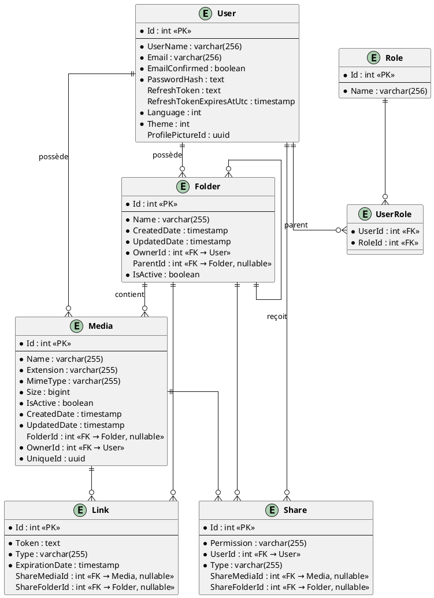
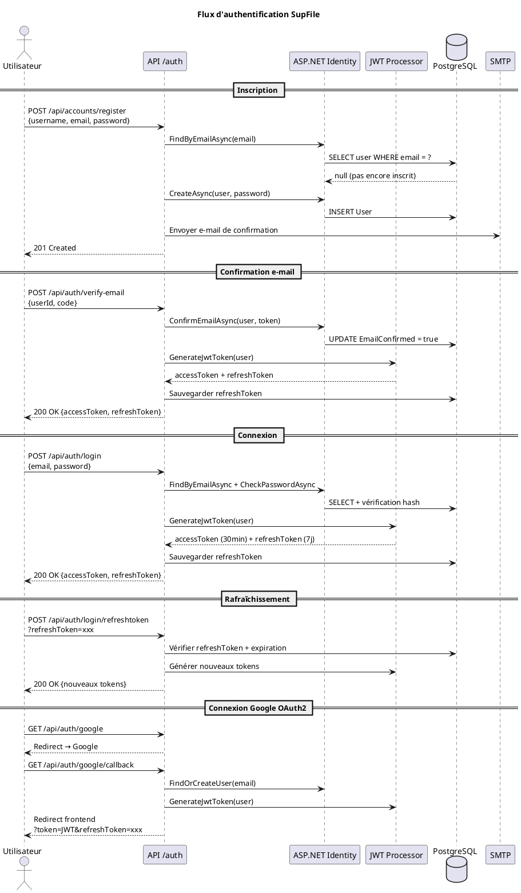
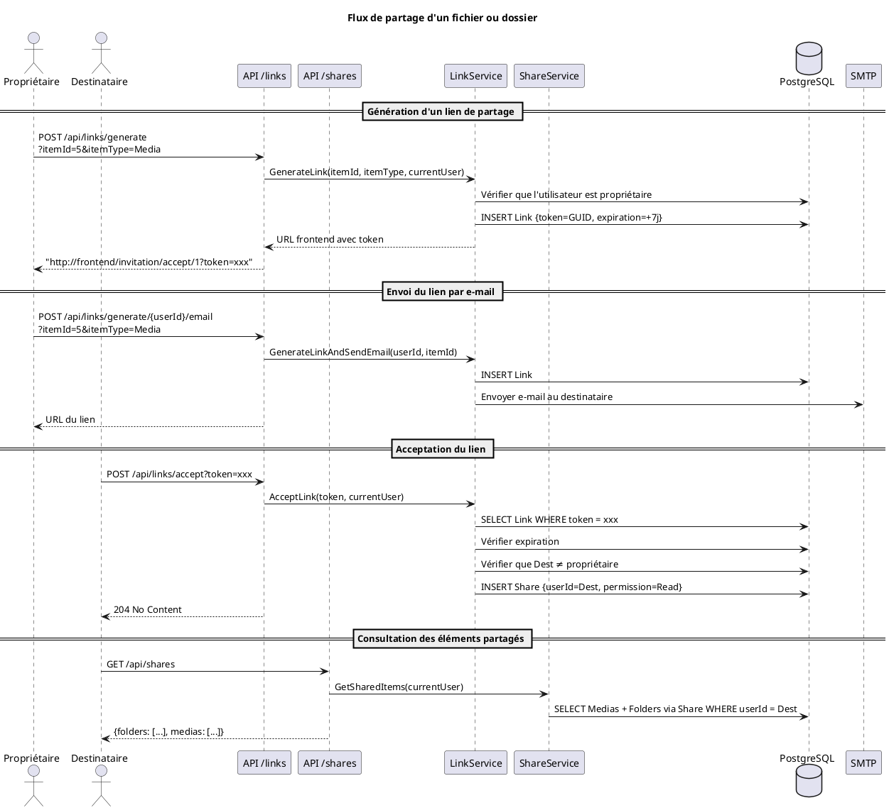

# SupFile
# Documentation technique

---

## Sommaire

1. [Vue d'ensemble du projet SupFile](#1-vue-densemble-du-projet-supfile)
   - 1.1. Description générale
   - 1.2. Architecture technique
   - 1.3. Fonctionnalités principales
   - 1.4. Intégrations et services externes
   - 1.5. Performances
   - 1.6. Perspectives d'évolution
2. [Configuration de l'environnement](#2-configuration-de-lenvironnement)
   - 2.1. Informations globales
   - 2.2. Étapes de configuration
   - 2.3. Résumé des différentes variables
3. [Déploiement du projet](#3-déploiement-du-projet)
   - 3.1. Vue d'ensemble
   - 3.2. Prérequis système
   - 3.3. Configuration des variables d'environnement
   - 3.4. Procédure de déploiement
   - 3.5. Health Checks et monitoring
   - 3.6. URLs de l'application
   - 3.7. Migrations et données initiales
   - 3.8. Sécurité en production
4. [Diagrammes UML](#4-diagrammes-uml)
   - 4.1. Diagramme des cas d'utilisation
   - 4.2. Diagramme du schéma relationnel (BDD)
   - 4.3. Diagramme d'authentification
   - 4.4. Diagramme du partage de fichiers
5. [Technologies et justifications](#5-technologies-et-justifications)
   - 5.1. Choix du framework backend
   - 5.2. Choix de la base de données
   - 5.3. Bibliothèques et outils complémentaires
   - 5.4. Services d'authentification
   - 5.5. Stockage de fichiers
6. [Architecture technique — API](#6-architecture-technique--api)
   - 6.1. Conception architecturale générale
   - 6.2. Patterns architecturaux implémentés
   - 6.3. Organisation en couches
   - 6.4. Infrastructure et middlewares
   - 6.5. Sécurité architecturale
7. [Architecture technique — Endpoints principaux](#7-architecture-technique--endpoints-principaux)
   - 7.1. Authentification et comptes
   - 7.2. Fichiers (Médias)
   - 7.3. Dossiers
   - 7.4. Partage
   - 7.5. Corbeille
   - 7.6. Utilisateurs
   - 7.7. Paramètres et santé
8. [Configuration OAuth2 Google](#8-configuration-oauth2-google)
9. [Configuration Azure Blob Storage](#9-configuration-azure-blob-storage)

---

## 1. Vue d'ensemble du projet SupFile

### 1.1. Description générale

SupFile est une application de stockage et de partage de fichiers en ligne, développée dans le cadre d'un projet étudiant. L'application propose une solution complète de gestion de fichiers permettant aux utilisateurs d'uploader, d'organiser et de partager leurs fichiers au sein d'une arborescence de dossiers personnelle.

Ce projet démontre la maîtrise des technologies modernes de développement backend full-stack, en intégrant une architecture de services containerisée, un système d'authentification sécurisé avec support OAuth2 (Google), un stockage cloud de fichiers via Azure Blob Storage, et un système de partage par lien ou invitation e-mail. L'objectif principal était de concevoir une plateforme de stockage personnelle complète en respectant les bonnes pratiques de développement et les standards de sécurité actuels.

### 1.2. Architecture technique

L'application repose sur une architecture en couches découplées séparant clairement les responsabilités. Le backend utilise **ASP.NET Core** avec **Entity Framework Core** pour l'accès aux données, une base **PostgreSQL** pour la persistance, et **Azure Blob Storage** pour le stockage des fichiers. Les clients (web, mobile) communiquent avec l'API exclusivement via des appels HTTP/HTTPS REST.

La solution est découpée en **six projets** distincts :

| Projet | Rôle |
|---|---|
| `SupFile.Back.Api` | Point d'entrée : contrôleurs, DI, middlewares, validation, Swagger |
| `SupFile.Back.Business` | Couche métier : services, logique applicative |
| `SupFile.Back.Core` | Domaine : entités, DTOs, enums, erreurs, interfaces |
| `SupFile.Back.Data` | Accès aux données : EF Core, DbContext, repositories, migrations |
| `SupFile.Back.Storage` | Abstraction du stockage : Azure Blob ou système de fichiers local |
| `SupFile.Back.Resources` | Localisation : fichiers RESX (anglais, français) |

La containerisation avec Docker permet un déploiement cohérent et reproductible. L'orchestration via Docker Compose gère les dépendances entre services, incluant la base de données PostgreSQL, le stockage de fichiers Azurite, et le serveur SMTP pour les notifications e-mail en développement.

Le système d'authentification hybride combine **ASP.NET Core Identity** pour la gestion locale des comptes avec un provider **OAuth2 Google**. Les tokens **JWT** assurent l'authentification stateless avec une durée de vie configurable de 30 minutes et un refresh token de 7 jours, permettant une scalabilité horizontale future.

### 1.3. Fonctionnalités principales

#### 1.3.1. Gestion de fichiers

Le cœur fonctionnel de l'application repose sur la gestion de médias. Les utilisateurs peuvent uploader des fichiers de tout type, qui sont stockés dans Azure Blob Storage avec un identifiant unique (GUID) comme clé de blob. Le type MIME est détecté automatiquement à l'upload via la bibliothèque **Mime-Detective**, indépendamment de l'extension fournie par le client.

Chaque fichier est consultable, téléchargeable, et prévisualisable. La prévisualisation est publique (sans authentification) via l'identifiant unique du fichier, ce qui facilite le partage de contenu. Un système de recherche avancée permet de filtrer par nom, extension, type, et plage de dates de modification.

#### 1.3.2. Organisation en dossiers

Les fichiers s'organisent dans une arborescence de dossiers hiérarchique. Chaque dossier peut contenir des sous-dossiers et des fichiers. Le fil d'Ariane (breadcrumb) permet de naviguer dans l'arborescence. Un dossier entier peut être téléchargé sous forme d'archive ZIP. Les suppressions sont récursives : supprimer un dossier envoie en corbeille l'ensemble de son contenu.

#### 1.3.3. Partage et collaboration

L'application implémente un système de partage en deux modes. Le premier mode génère un **lien de partage** à durée limitée (7 jours) que n'importe quel utilisateur authentifié peut accepter. Le second mode envoie ce lien **directement par e-mail** à un utilisateur cible identifié dans la plateforme. L'acceptation d'un lien crée automatiquement un enregistrement de partage en lecture associant l'utilisateur au fichier ou dossier concerné.

#### 1.3.4. Corbeille

La suppression dans SupFile est logique : les éléments supprimés sont marqués `IsActive = false` et déplacés dans une corbeille. L'utilisateur peut restaurer individuellement un élément, le supprimer définitivement, ou vider intégralement sa corbeille. La restauration d'un dossier est récursive et restaure l'ensemble de l'arborescence enfant.

### 1.4. Intégrations et services externes

L'authentification **OAuth2 Google** facilite l'adoption en permettant aux utilisateurs de se connecter via leur compte existant, réduisant les frictions d'inscription tout en déléguant la gestion sécurisée des mots de passe à Google.

Les services **SMTP** gèrent l'envoi des e-mails de confirmation de compte et des liens d'invitation au partage. En développement, **SMTP4Dev** intercepte tous les e-mails sortants et les expose via une interface web, sans envoi réel. **FluentEmail** avec les templates **Razor** permet de construire des e-mails HTML riches en conservant la cohérence architecturale .NET.

**Azure Blob Storage** optimise le stockage et la distribution des fichiers uploadés par les utilisateurs avec une évolutivité horizontale. En développement, **Azurite** émule fidèlement le service localement.

### 1.5. Performances

L'application implémente plusieurs optimisations de performance : requêtes Entity Framework asynchrones systématiques, filtrage et tri dynamiques via **Gridify** directement en base de données, et pagination des listes. Le stockage blob découple les transferts de fichiers du serveur applicatif, évitant la saturation de la mémoire lors d'uploads/téléchargements volumineux.

### 1.6. Perspectives d'évolution

L'architecture modulaire facilite l'ajout de nouvelles fonctionnalités. Les extensions prioritaires incluent l'ajout des providers **GitHub** et **Microsoft** (déjà référencés dans les dépendances NuGet), un système de **versioning** de fichiers pour conserver l'historique des modifications, et des **permissions granulaires** de partage (lecture seule, édition) au lieu du simple accès en lecture actuel.

L'ajout d'une interface d'administration permettrait de gérer les utilisateurs, surveiller les quotas de stockage et modérer le contenu.

---

## 2. Configuration de l'environnement

### 2.1. Informations globales

Par défaut, aucune variable d'environnement n'est configurée lors du premier clonage du projet. Un fichier de référence `.env.example` est fourni avec des valeurs par défaut fonctionnelles pour le développement local.

Ces valeurs par défaut permettent de lancer l'application rapidement depuis Docker mais **doivent être modifiées** pour une mise en production réelle.

### 2.2. Étapes de configuration

**1. Copier le fichier d'exemple**

```bash
cp .env.example .env
```

**2. Adapter les variables selon votre environnement**

Éditez le fichier `.env` créé pour correspondre à votre configuration locale.

**⚠️ Avant mise en production, modifier obligatoirement :**

- `POSTGRES_PASSWORD` : Mot de passe PostgreSQL sécurisé
- `APPSETTINGS__DEFAULTUSERPASSWORD` : Mot de passe de l'administrateur par défaut
- `JWTSETTINGS__SECRET` : Clé de signature JWT (minimum 256 bits, aléatoire)
- `AUTHPROVIDERSETTINGS__GOOGLE__CLIENTID` et `CLIENTSECRET` : Valeurs réelles de la Google Cloud Console
- `BLOBSTORAGESETTINGS__CONNECTIONSTRING` : Chaîne de connexion Azure Blob Storage réelle

**3. Générer le certificat HTTPS (première installation uniquement)**

OAuth2 Google requiert HTTPS. Exécuter ces commandes une seule fois :

```bash
dotnet dev-certs https --clean
mkdir -p ~/.aspnet/https
dotnet dev-certs https -ep ~/.aspnet/https/aspnetapp.pfx -p MyStrongPassword123
dotnet dev-certs https --trust
```

### 2.3. Résumé des différentes variables

#### 2.3.1. Globales

```env
# Production ou Development
ASPNETCORE_ENVIRONMENT=Development
DOTNET_ENVIRONMENT=Development

# Informations générales sur l'API
APPSETTINGS__ENVIRONMENT=Dev
APPSETTINGS__NAME='[DOCKER Dev] SupFile API'
APPSETTINGS__DESCRIPTION='SupFile is a storage application that allows users to share files.'
APPSETTINGS__VERSION=1.0.0

# Boolean d'affichage du Swagger
# ⚠️ Recommandation : dev=true, production=false
APPSETTINGS__ALLOWSWAGGER=true

# Cultures supportées (pour ajouter une culture, incrémenter l'index)
APPSETTINGS__SUPPORTEDCULTURES__0=en
APPSETTINGS__SUPPORTEDCULTURES__1=fr

# SupFile crée automatiquement un compte admin au lancement
# ⚠️ Modifier ces variables
APPSETTINGS__DEFAULTUSEREMAIL="admin@supfile.com"
APPSETTINGS__DEFAULTUSERPASSWORD="Soleil123!"

# Quota de stockage global alloué (en octets, ici 30 Gio)
APPSETTINGS__ALLOCATEDSPACE=32212254720

# Activer/désactiver la vérification d'e-mail obligatoire à l'inscription
APPSETTINGS__REQUIREEMAILVERIFICATION=true

# Lien de redirection vers le frontend pour la confirmation d'e-mail
APPSETTINGS__EMAILVERIFICATIONFRONTENDLINK="http://localhost:5173/login/confirmEmail"

# Lien de redirection vers le frontend pour l'acceptation d'une invitation de partage
# {0} = userId, {1} = token
APPSETTINGS__EMAILGENERATIONFRONTENDLINK="http://localhost:5173/invitation/accept/{0}?token={1}"

# URL du logo SupFile (utilisée dans les e-mails)
APPSETTINGS__LOGOURL="http://localhost:5263/SupFileLogo.png"
```

#### 2.3.2. PostgreSQL

```env
# --- PostgreSQL Settings ---
POSTGRES_USER=votre_user
POSTGRES_PASSWORD=MyStrongPassword123  # ⚠️ Modifier cette variable
POSTGRES_DB=SupFile-Dev

# Chaîne de connexion complète (référence les variables ci-dessus)
CONNECTIONSTRINGS__POSTGRES="Host=postgres;Port=5432;Password=${POSTGRES_PASSWORD};Persist Security Info=True;Username=${POSTGRES_USER};Database=${POSTGRES_DB}"
```

#### 2.3.3. CORS

```env
# Pour ajouter une origine autorisée, incrémenter l'index
CORS__ALLOWEDORIGINS__0="http://localhost:5173"
CORS__ALLOWEDORIGINS__1="http://localhost:8081"
CORS__ALLOWEDORIGINS__2="http://localhost:3000"
```

#### 2.3.4. HTTPS et certificat

```env
# URLs d'écoute de l'API
ASPNETCORE_URLS=https://+:7268;http://+:5263

# Certificat TLS (généré lors de l'installation)
ASPNETCORE_KESTREL__CERTIFICATES__DEFAULT__PATH=/https/aspnetapp.pfx
ASPNETCORE_KESTREL__CERTIFICATES__DEFAULT__PASSWORD=MyStrongPassword123
```

#### 2.3.5. Encryption des tokens (JWT)

```env
# Clé de signature pour le JSON Web Token (minimum 256 bits)  ⚠️ Modifier cette variable
JWTSETTINGS__SECRET="RJFIJRclrcjrmlcrejcERCJERLRJRLrlkrjfreekerJERCRckrjcrRJFLKRFJRLkrjRKjrlkrJRFLKFRJFLK"
JWTSETTINGS__ISSUER="Supfile"
JWTSETTINGS__AUDIENCE="SupfileUsers"

# Durée de vie du token d'accès (en minutes)
JWTSETTINGS__ACCESSTOKENEXPIRATIONTIMEINMINUTES=30

# Durée de vie du refresh token (en minutes, ici 7 jours)
JWTSETTINGS__REFRESHTOKENEXPIRATIONTIMEINMINUTES=10080
```

#### 2.3.6. Serveur mail (SMTP)

```env
# En développement : smtp4dev intercepte les e-mails sans les envoyer réellement
SMTPSETTINGS__SERVER=smtp4dev
SMTPSETTINGS__PORT=25
SMTPSETTINGS__USERNAME=""
SMTPSETTINGS__PASSWORD=""
SMTPSETTINGS__USESSL=false
SMTPSETTINGS__MAILFROM="supfile@noreply.com"
SMTPSETTINGS__MAILFROMDISPLAYNAME="SupFile"

# En production, remplacer par les valeurs réelles du serveur SMTP
# SMTPSETTINGS__SERVER=smtp.votredomaine.com
# SMTPSETTINGS__PORT=587
# SMTPSETTINGS__USESSL=true
```

#### 2.3.7. Stockage de fichiers (Azure Blob)

```env
# Nom du conteneur de stockage des fichiers
BLOBSTORAGESETTINGS__CONTAINERNAME="supfile-files"

# Chaîne de connexion (ici Azurite en développement)  ⚠️ Modifier en production
BLOBSTORAGESETTINGS__CONNECTIONSTRING="DefaultEndpointsProtocol=http;AccountName=devstoreaccount1;AccountKey=Eby8vdM02xNOcqFlqUwJPLlmEtlCDXJ1OUzFT50uSRZ6IFsuFq2UVErCz4I6tq/K1SZFPTOtr/KgtZkiP3Pqew==;BlobEndpoint=http://azureblobstorage:10000/devstoreaccount1"
```

Pour plus d'informations, voir la section [9. Configuration Azure Blob Storage](#9-configuration-azure-blob-storage).

#### 2.3.8. Providers d'authentification (OAuth2)

```env
# Google OAuth2  ⚠️ Modifier ces variables (voir section 8)
AUTHPROVIDERSETTINGS__GOOGLE__CLIENTID="votre-client-id.apps.googleusercontent.com"
AUTHPROVIDERSETTINGS__GOOGLE__CLIENTSECRET="GOCSPX-votre-client-secret"
```

Pour plus d'informations, voir la section [8. Configuration OAuth2 Google](#8-configuration-oauth2-google).

#### 2.3.9. Logging (Serilog)

```env
# Niveau de log minimum (Debug en dev, Warning en prod)
SERILOG__MINIMUMLEVEL__DEFAULT=Debug
SERILOG__MINIMUMLEVEL__OVERRIDE__MICROSOFT=Warning
SERILOG__MINIMUMLEVEL__OVERRIDE__OPENIDDICT=Warning
SERILOG__MINIMUMLEVEL__OVERRIDE__MICROSOFT_ENTITYFRAMEWORKCORE_DATABASE_COMMAND=Information
SERILOG__WRITETO__0__NAME=Console
```

#### 2.3.10. Frontend

```env
# URL de base du frontend (utilisée pour construire les liens dans les e-mails)
FRONTENDSETTINGS__BASEURL="http://localhost:5173/"
FRONTENDSETTINGS__EMAILVERIFICATIONLINK="login/confirm-email"
FRONTENDSETTINGS__RESETPASSWORDLINK="reset-password"
```

---

## 3. Déploiement du projet

### 3.1. Vue d'ensemble

L'application SupFile utilise Docker Compose pour orchestrer l'ensemble des services nécessaires au fonctionnement de l'application. L'architecture déployée comprend :

- **API Backend .NET** (ports 5263 HTTP / 7268 HTTPS)
- **Base de données PostgreSQL** (port 5433)
- **Stockage de fichiers Azurite** (port 10000) — remplacé par Azure Blob Storage en production
- **Serveur SMTP SMTP4Dev** (port 5001) — remplacé par un vrai serveur SMTP en production

### 3.2. Prérequis système

- Docker Desktop installé et fonctionnel
- Docker Compose v2.x ou supérieur
- Minimum 2 GB RAM disponible pour les conteneurs
- Ports disponibles : 5263, 7268, 5433, 10000, 5001
- .NET SDK 10.0 (uniquement pour les migrations manuelles ou le développement sans Docker)

### 3.3. Configuration des variables d'environnement

Configurer le `.env` avant de lancer l'application, voir section [2. Configuration de l'environnement](#2-configuration-de-lenvironnement).

### 3.4. Procédure de déploiement

**1. Préparation de l'environnement**

```bash
# Cloner le dépôt
git clone <url-du-depot>
cd SupFile-Back

# Créer le fichier de configuration
cp .env.example .env
```

**2. Générer le certificat HTTPS** (première installation uniquement)

```bash
dotnet dev-certs https --clean
mkdir -p ~/.aspnet/https
dotnet dev-certs https -ep ~/.aspnet/https/aspnetapp.pfx -p MyStrongPassword123
dotnet dev-certs https --trust
```

**3. Éditer le `.env`** avec les valeurs de l'environnement cible.

Pour plus d'informations sur l'environnement, se référer à la section 2 : Configuration de l'environnement.

**4. Lancement des services**

```bash
# Démarrage en mode développement avec profil dev
docker compose --profile dev --env-file .env up -d

# Vérifier le statut des services
docker compose ps
```

**5. Vérification du déploiement (optionnel)**

```bash
# Vérifier l'état de santé de l'API
curl https://localhost:7268/health
```

### 3.5. Health Checks et monitoring

#### 3.5.1. Vérifications automatiques

Le système Docker dispose de health checks automatiques au moment du lancement :

- **API** : vérification sur `/health` (endpoint ASP.NET Core Health Checks)
- **PostgreSQL** : test `pg_isready` avec retry automatique (5 tentatives, toutes les 10 secondes)
- **Azurite** : connectivité réseau sur le port 10000

L'API ne démarre qu'après que PostgreSQL et Azurite soient déclarés sains (`depends_on: condition: service_healthy`).

### 3.6. URLs de l'application

Après déploiement réussi, l'application est accessible sur :

| Service | URL |
|---|---|
| API (HTTPS) | `https://localhost:7268` |
| API (HTTP) | `http://localhost:5263` |
| Swagger UI | `https://localhost:7268/swagger` |
| Health Check | `https://localhost:7268/health` |
| SMTP4Dev (interface e-mails) | `http://localhost:5001` |

### 3.7. Migrations et données initiales

#### 3.7.1. Processus automatisé

Au premier démarrage de l'API :

1. Application automatique des migrations Entity Framework Core
2. Création automatique des tables de base de données
3. Seed des données initiales : création du compte administrateur avec les credentials du `.env` (`APPSETTINGS__DEFAULTUSEREMAIL` et `APPSETTINGS__DEFAULTUSERPASSWORD`)

#### 3.7.2. Application manuelle des migrations

```bash
# Appliquer les migrations
dotnet ef database update \
  --project SupFile.Back.Data/SupFile.Back.Data.csproj \
  --startup-project SupFile.Back.Api/SupFile.Back.Api.csproj \
  --context SupFile.Back.Data.Context.SupFileContext \
  --configuration Debug

# Créer une nouvelle migration
dotnet ef migrations add <NomMigration> \
  --project SupFile.Back.Data/SupFile.Back.Data.csproj \
  --startup-project SupFile.Back.Api/SupFile.Back.Api.csproj \
  --context SupFile.Back.Data.Context.SupFileContext \
  --configuration Debug \
  --output-dir Migrations
```

### 3.8. Sécurité en production

Recommandations essentielles en cas de mise en production sur un serveur :

- **Firewall** : Fermer les ports 5432 (PostgreSQL), 10000 (Azurite), et 5001 (SMTP4Dev)
- **Reverse Proxy** : Utiliser Nginx ou Traefik pour exposer uniquement les ports 80/443
- **HTTPS** : Configurer SSL/TLS avec des certificats valides (Let's Encrypt ou certificat d'entreprise)
- **Swagger** : Désactiver en production (`APPSETTINGS__ALLOWSWAGGER=false`)
- **Backup** : Automatiser les sauvegardes quotidiennes de la base PostgreSQL et du blob storage
- **Monitoring** : Surveiller les logs Serilog et les métriques système
- **Secrets** : Ne pas utiliser le fichier `.env` directement en production ; préférer les secrets Docker Swarm, Kubernetes Secrets, ou un gestionnaire de secrets (Azure Key Vault)

---

## 4. Diagrammes UML

### 4.1. Diagramme des cas d'utilisation

```plantuml
@startuml
left to right direction
skinparam packageStyle rectangle

actor "Utilisateur anonyme" as Anon
actor "Utilisateur authentifié" as User

rectangle "SupFile API" {

  package "Authentification" {
    usecase "S'inscrire" as UC_Register
    usecase "Se connecter (email/mdp)" as UC_Login
    usecase "Se connecter via Google" as UC_OAuth
    usecase "Confirmer son e-mail" as UC_ConfirmEmail
    usecase "Réinitialiser son mot de passe" as UC_ResetPwd
    usecase "Rafraîchir le token" as UC_Refresh
  }

  package "Fichiers" {
    usecase "Uploader un fichier" as UC_Upload
    usecase "Télécharger un fichier" as UC_Download
    usecase "Prévisualiser un fichier" as UC_Preview
    usecase "Rechercher des fichiers" as UC_SearchMedia
    usecase "Renommer / déplacer un fichier" as UC_PatchMedia
    usecase "Envoyer en corbeille" as UC_SoftDeleteMedia
    usecase "Consulter l'espace de stockage" as UC_StorageSize
  }

  package "Dossiers" {
    usecase "Créer un dossier" as UC_CreateFolder
    usecase "Lister le contenu" as UC_ListFolder
    usecase "Renommer / déplacer" as UC_PatchFolder
    usecase "Télécharger en ZIP" as UC_DownloadFolder
    usecase "Envoyer en corbeille" as UC_SoftDeleteFolder
  }

  package "Partage" {
    usecase "Générer un lien de partage" as UC_GenLink
    usecase "Envoyer un lien par e-mail" as UC_SendLink
    usecase "Accepter un lien" as UC_AcceptLink
    usecase "Voir les éléments partagés" as UC_SharedItems
  }

  package "Corbeille" {
    usecase "Voir la corbeille" as UC_ViewBin
    usecase "Restaurer un élément" as UC_Restore
    usecase "Supprimer définitivement" as UC_HardDelete
    usecase "Vider la corbeille" as UC_EmptyBin
  }

  package "Profil" {
    usecase "Voir son profil" as UC_Profile
    usecase "Modifier son profil" as UC_EditProfile
    usecase "Changer son mot de passe" as UC_ChangePwd
    usecase "Gérer sa photo de profil" as UC_EditPicture
    usecase "Voir une photo de profil" as UC_ViewPicture
    usecase "Supprimer son compte" as UC_DeleteAccount
    usecase "Rechercher des utilisateurs" as UC_SearchUser
  }
}

Anon --> UC_Register
Anon --> UC_Login
Anon --> UC_OAuth
Anon --> UC_ConfirmEmail
Anon --> UC_ResetPwd
Anon --> UC_Preview
Anon --> UC_ViewPicture

User --> UC_Refresh
User --> UC_Upload
User --> UC_Download
User --> UC_SearchMedia
User --> UC_PatchMedia
User --> UC_SoftDeleteMedia
User --> UC_StorageSize
User --> UC_CreateFolder
User --> UC_ListFolder
User --> UC_PatchFolder
User --> UC_DownloadFolder
User --> UC_SoftDeleteFolder
User --> UC_GenLink
User --> UC_SendLink
User --> UC_AcceptLink
User --> UC_SharedItems
User --> UC_ViewBin
User --> UC_Restore
User --> UC_HardDelete
User --> UC_EmptyBin
User --> UC_Profile
User --> UC_EditProfile
User --> UC_ChangePwd
User --> UC_EditPicture
User --> UC_DeleteAccount
User --> UC_SearchUser
@enduml
```



---

### 4.2. Diagramme du schéma relationnel (BDD)



---

### 4.3. Diagramme d'authentification



---

### 4.4. Diagramme du partage de fichiers



---

## 5. Technologies et justifications

### 5.1. Choix du framework backend

#### 5.1.1. ASP.NET Core / .NET 10

Le choix d'ASP.NET Core pour le backend s'appuie sur plusieurs considérations techniques et stratégiques majeures. Cette plateforme offre des performances exceptionnelles comparées aux solutions concurrentes, avec un throughput parmi les plus élevés selon les benchmarks TechEmpower. Cette performance est cruciale pour une application de stockage où la manipulation de fichiers volumineux et les opérations I/O intensives exigent une gestion optimale des ressources.

L'écosystème .NET mature apporte une productivité de développement élevée grâce à un outillage intégré complet. L'IntelliSense avancé, le debugging intégré et la documentation exhaustive accélèrent significativement le développement. Le système de packages NuGet centralise l'accès aux bibliothèques tierces avec gestion automatique des dépendances.

La nature cross-platform d'ASP.NET Core permet un déploiement flexible sur Linux, Windows ou macOS, réduisant les coûts d'infrastructure et offrant une liberté de choix d'hébergement. Cette portabilité s'étend à la containerisation Docker, où les images .NET optimisées minimisent la taille des conteneurs.

#### 5.1.2. Entity Framework Core

Entity Framework Core constitue un choix naturel pour l'accès aux données dans l'écosystème .NET. Son approche **Code First** permet de définir le modèle de données directement en C#, générant automatiquement le schéma de base de données via les migrations. Cette méthode garantit la cohérence entre le code et la structure de données tout en facilitant l'évolution contrôlée du schéma.

L'intégration avec LINQ offre une syntaxe expressive pour les requêtes complexes, tout en conservant la possibilité d'exécuter du SQL brut quand les performances l'exigent. L'héritage d'`IdentityDbContext` intègre nativement la gestion des utilisateurs, rôles et claims ASP.NET Identity sans configuration supplémentaire.

### 5.2. Choix de la base de données

#### 5.2.1. PostgreSQL

PostgreSQL a été retenu pour ses qualités techniques exceptionnelles et sa fiabilité éprouvée en production. Ce système de gestion de base de données respecte strictement les propriétés ACID, garantissant la cohérence des données même lors de pannes système ou de montée en charge.

Les performances de PostgreSQL surpassent souvent MySQL dans les benchmarks pour les workloads mixtes lecture/écriture typiques d'une application collaborative. La gestion sophistiquée des verrous et l'optimiseur de requêtes avancé maintiennent des performances stables même sous charge élevée.

L'écosystème open source de PostgreSQL réduit les coûts de licence tout en offrant une communauté active et des extensions riches. Le driver **Npgsql** offre une intégration native et performante avec EF Core.

### 5.3. Bibliothèques et outils complémentaires

#### 5.3.1. FluentResults

FluentResults remplace avantageusement les exceptions pour la gestion des erreurs métier prévisibles (utilisateur non trouvé, permission refusée, quota dépassé). Chaque méthode de service retourne un `Result<T>` qui encapsule explicitement le succès ou l'échec. Cette approche rend les cas d'erreur visibles dans les signatures de méthode, évite les exceptions coûteuses pour les flux normaux, et simplifie le mapping vers les codes HTTP dans les contrôleurs.

#### 5.3.2. FluentValidation

FluentValidation remplace avantageusement les Data Annotations pour la validation des modèles d'entrée grâce à sa syntaxe expressive et sa flexibilité. La séparation claire entre les règles de validation et les modèles de données améliore la lisibilité et la maintenabilité du code. Les validateurs sont enregistrés automatiquement par scan d'assembly au démarrage.

#### 5.3.3. Mapster

Mapster a été préféré à AutoMapper pour ses performances supérieures et sa configuration simplifiée. Cette bibliothèque génère du code de mapping à la compilation plutôt qu'au runtime, éliminant l'overhead de réflexion. La syntaxe intuitive de Mapster réduit le code boilerplate nécessaire pour convertir entre entités EF Core et DTOs/modèles d'API.

#### 5.3.4. Gridify

Gridify permet d'appliquer dynamiquement des filtres, tris et paginatons directement sur les requêtes Entity Framework Core depuis des paramètres de requête HTTP. La traduction vers SQL s'effectue côté base de données, évitant de charger inutilement des données en mémoire. Cette bibliothèque est utilisée pour les endpoints de recherche de fichiers et de dossiers.

#### 5.3.5. Serilog

Serilog modernise le logging avec une approche de **logging structuré**, permettant d'enrichir les logs avec des propriétés typées plutôt que de simples chaînes de caractères. Cette structure facilite l'analyse et la recherche dans les logs, particulièrement utile pour le debugging et le monitoring en production. L'extensibilité de Serilog via ses sinks permet d'adapter la destination selon l'environnement : console en développement, fichiers ou services cloud en production.

#### 5.3.6. Mime-Detective

Mime-Detective détecte le type MIME d'un fichier en analysant ses **magic bytes** (en-tête binaire), indépendamment de l'extension fournie par le client. Cette approche est plus fiable et sécurisée qu'une simple vérification d'extension, empêchant les utilisateurs de déguiser un fichier malveillant en changeant son extension.

### 5.4. Services d'authentification

#### 5.4.1. JWT (JSON Web Tokens)

Les tokens JWT **stateless** permettent une scalabilité horizontale sans session serveur. La validation cryptographique s'effectue automatiquement à chaque requête via la clé secrète HMAC-SHA256. La durée de vie courte du token d'accès (30 minutes) limite l'exposition en cas de compromission, tandis que le refresh token (7 jours) permet une expérience utilisateur fluide sans reconnexion fréquente.

Le claim personnalisé `uid` embarque directement l'identifiant de l'utilisateur dans le token, évitant une requête base de données supplémentaire pour identifier l'utilisateur courant dans chaque requête.

#### 5.4.2. Providers OAuth2 (Google)

L'intégration d'OAuth2 Google facilite l'adoption en permettant aux utilisateurs de se connecter via leur compte existant. Cette approche réduit les frictions d'inscription tout en déléguant la gestion sécurisée des mots de passe à Google. Le standard OAuth2 garantit la sécurité des échanges sans exposer les credentials utilisateur à l'application.

#### 5.4.3. SMTP et notifications e-mail

FluentEmail modernise l'envoi d'e-mails avec une API fluide et le support des **templates Razor**, permettant de créer des e-mails HTML riches directement depuis les vues .NET. Cette intégration maintient la cohérence architecturale tout en simplifiant la maintenance des templates. En développement, SMTP4Dev intercepte tous les e-mails sortants sans envoi réel.

### 5.5. Stockage de fichiers

#### 5.5.1. Azure Blob Storage / Azurite

Azure Blob Storage fournit une solution de stockage d'objets **scalable et économique** pour les fichiers uploadés. Cette approche découple le stockage des fichiers du serveur applicatif, améliorant les performances et la fiabilité : les fichiers ne sont pas liés au cycle de vie du conteneur applicatif. Chaque fichier est stocké avec son `UniqueId` (GUID) comme clé de blob, garantissant l'unicité et évitant les conflits de noms.

L'interface `IStorageProvider` abstrait le fournisseur de stockage. Cela permet de basculer vers un stockage local sur le système de fichiers (`FileStorageProvider`) sans modifier la logique métier, ce qui facilite les tests et offre une alternative en cas d'indisponibilité du cloud.

Azurite, l'émulateur local d'Azure Storage, permet de développer et tester localement sans dépendre du cloud ni supporter de coûts. La compatibilité d'interface garantit qu'aucune modification de code n'est nécessaire lors du passage à Azure réel.

---

## 6. Architecture technique — API

### 6.1. Conception architecturale générale

L'architecture de SupFile.Back.Api suit une approche en **couches découplées**, favorisant la maintenabilité et l'évolutivité du système. Cette conception sépare clairement les responsabilités entre la présentation (contrôleurs), la logique métier (services), l'accès aux données (repositories) et l'infrastructure technique (stockage, e-mail).

Les clients web et mobile communiquent exclusivement avec l'API backend via **HTTP/HTTPS**, garantissant une interface uniforme et sécurisée.

### 6.2. Patterns architecturaux implémentés

#### 6.2.1. Repository Pattern

Le Repository Pattern abstrait l'accès aux données en fournissant une interface uniforme pour les opérations CRUD. Chaque entité principale dispose de son repository spécialisé (`MediaRepository`, `FolderRepository`, `LinkRepository`, `ShareRepository`, `UserRepository`), offrant des méthodes métier adaptées aux besoins spécifiques. Cette abstraction simplifie les évolutions futures de la couche de persistance.

#### 6.2.2. Result Pattern (FluentResults)

Toutes les méthodes de service retournent un `Result<T>` ou `Result` au lieu de lever des exceptions pour les erreurs prévisibles. Les contrôleurs mappent ces résultats vers les codes HTTP appropriés via les méthodes helper `ToOkActionResult`, `ToCreatedAtActionResult`, `ToNoContentActionResult`. Ce pattern rend les flux d'erreur explicites et facilite la traçabilité des cas d'échec.

#### 6.2.3. Dependency Injection

L'injection de dépendances structure l'ensemble de l'application en inversant le contrôle des instanciations. Le conteneur IoC d'ASP.NET Core gère automatiquement les cycles de vie des services (Transient pour les services métier, Singleton pour les services de stockage). Les services sont enregistrés via des méthodes d'extension dans `DependencyInjection.cs`.

#### 6.2.4. Models et Mapping (Mapster)

Les modèles API (`FolderModel`, `MediaModel`, `UserModel`, etc.) assurent une séparation claire entre les entités de domaine internes et les contrats exposés aux clients. Cette isolation protège l'architecture interne des changements et permet une validation spécifique des données d'entrée et de sortie. Mapster gère automatiquement les conversions entre entités et modèles.

### 6.3. Organisation en couches

#### 6.3.1. Schéma d'architecture

```
┌─────────────────────────────────────────┐
│             Client (Web / Mobile)        │
└───────────────────┬─────────────────────┘
                    │ HTTP/HTTPS (REST)
┌───────────────────▼─────────────────────┐
│         SupFile.Back.Api                 │
│  Contrôleurs · Validation · Middlewares  │
└───────────────────┬─────────────────────┘
                    │
┌───────────────────▼─────────────────────┐
│         SupFile.Back.Business            │
│      Services · Logique métier           │
└──────────┬────────────────┬─────────────┘
           │                │
┌──────────▼──────┐  ┌──────▼──────────────┐
│ SupFile.Back    │  │ SupFile.Back.Storage  │
│    .Data        │  │  IStorageProvider     │
│ Repositories    │  │  BlobStorageProvider  │
│ EF Core / PgSQL │  │  Azure Blob / Azurite │
└─────────────────┘  └───────────────────────┘
```

#### 6.3.2. Couche Présentation (Api)

Les contrôleurs ASP.NET Core constituent le point d'entrée de l'API, gérant les requêtes HTTP et orchestrant les appels aux services métier. Deux classes de base structurent l'héritage :

- **`BaseController`** : fournit les méthodes helper de mapping `Result<T>` → codes HTTP
- **`BaseAuthController`** : étend `BaseController`, ajoute l'attribut `[Authorize]` et la méthode `GetAuthenticatedAppUserAsync()` qui charge l'utilisateur courant depuis le claim `uid` du JWT

Chaque contrôleur se concentre sur un domaine fonctionnel spécifique. Les attributs de validation FluentValidation s'appliquent automatiquement avant l'exécution des actions.

#### 6.3.3. Couche Services Métier (Business)

Les services métier encapsulent la logique applicative complexe, orchestrant les appels aux repositories et implémentant les règles de gestion (quotas de stockage, vérification des droits de propriété, validation des expirations de liens). Cette couche reste indépendante des détails d'infrastructure, facilitant les tests et les évolutions futures. L'implémentation asynchrone systématique optimise les performances sous charge.

#### 6.3.4. Couche Accès aux Données (Data)

Entity Framework Core gère la persistance avec un `SupFileContext` principal centralisant les configurations d'entités via Fluent API. Les migrations automatiques assurent l'évolution contrôlée du schéma. Un `IDbContextFactory<SupFileContext>` avec lifetime Transient permet des opérations de longue durée sans conflits de contexte.

### 6.4. Infrastructure et middlewares

#### 6.4.1. Pipeline de requêtes (ordre d'exécution)

1. `ForwardedHeaders` — support reverse proxy (X-Forwarded-For/Proto)
2. `UseCors` — politique CORS `SupFile` (origines configurées dans `.env`)
3. `UseStaticFiles` — fichiers statiques (logo, assets)
4. `UseSwagger` / `UseSwaggerUI` — documentation interactive (si activée)
5. `UseHttpsRedirection` — redirection HTTP → HTTPS
6. `RequestLoggingMiddleware` — journalisation de chaque requête avec Serilog
7. `UseAuthentication` — validation du token JWT Bearer
8. `UseAuthorization` — vérification des attributs `[Authorize]`
9. `ExceptionHandler` — gestion globale des exceptions non catchées
10. `MapControllers` — routage vers les contrôleurs
11. `MapHealthChecks("/health")` — endpoint de santé

#### 6.4.2. Gestion globale des erreurs

Deux handlers d'exception sont enregistrés :
- **`ValidationExceptionHandler`** : intercepte les `ValidationException` de FluentValidation → HTTP 400 avec `ValidationProblemDetails` (liste des erreurs par champ)
- **`GlobalExceptionHandler`** : catch-all → HTTP 500 avec `ProblemDetails` standard

Toutes les réponses d'erreur incluent un `requestId` (trace identifier) permettant la corrélation dans les logs.

#### 6.4.3. Configuration et environnements

La configuration utilise le système intégré d'ASP.NET Core, combinant variables d'environnement et fichier `.env`. Cette approche respecte le principe des **12-factor apps**, facilitant le déploiement dans différents environnements sans modification de code. Les POCOs de configuration sont fortement typés (`AppSettings`, `JwtSettings`, `SmtpSettings`, `BlobStorageSettings`, etc.) et validés au démarrage.

### 6.5. Sécurité architecturale

#### 6.5.1. Authentification et autorisation

L'architecture de sécurité combine ASP.NET Core Identity pour la gestion locale des comptes avec le provider OAuth2 Google. Les tokens JWT stateless permettent une scalabilité horizontale sans session serveur, avec validation cryptographique automatique à chaque requête (HMAC-SHA256, `ClockSkew = 0`).

La vérification de propriété s'effectue au niveau des services métier : chaque opération sensible vérifie que l'utilisateur courant est bien le propriétaire de la ressource avant d'autoriser la modification.

#### 6.5.2. Protection des données

La suppression logique (soft delete) protège contre la perte accidentelle de données : aucun fichier n'est immédiatement supprimé de la base de données ou du stockage blob lors d'une suppression utilisateur. La corbeille constitue un filet de sécurité avant la suppression permanente.

La vérification du quota de stockage s'effectue avant chaque upload : si l'espace alloué (`AllocatedSpace`) serait dépassé par le fichier entrant, l'upload est refusé avec une erreur explicite.

La détection du type MIME par magic bytes (Mime-Detective) empêche l'upload de fichiers dont le contenu ne correspond pas à l'extension déclarée.

---

## 7. Architecture technique — Endpoints principaux

L'API suit les conventions REST. Toutes les réponses d'erreur utilisent le format **ProblemDetails** (RFC 7807). Les réponses de succès retournent directement les objets JSON.

**Base URL** : `https://localhost:7268/api`

**Authentification** : Bearer token JWT dans l'en-tête `Authorization: Bearer <token>` ou cookie `ACCESS_TOKEN`.

### 7.1. Authentification et comptes

| Méthode | Endpoint | Auth | Description |
|---|---|---|---|
| `POST` | `/api/accounts/register` | Non | Inscription (username, email, password) |
| `GET` | `/api/accounts/me` | JWT | Profil de l'utilisateur courant |
| `POST` | `/api/auth/login` | Non | Connexion — retourne access + refresh token |
| `POST` | `/api/auth/login/refreshtoken` | Non | Rafraîchit les deux tokens |
| `POST` | `/api/auth/verify-email` | Non | Confirme l'e-mail (userId + code) |
| `POST` | `/api/auth/resend-verification` | Non | Renvoie l'e-mail de confirmation |
| `POST` | `/api/auth/forgot-password` | Non | Demande de réinitialisation de mot de passe |
| `POST` | `/api/auth/reset-password` | Non | Applique le nouveau mot de passe |
| `GET` | `/api/auth/google` | Non | Initie le flux OAuth2 Google |
| `GET` | `/api/auth/google/callback` | Non | Callback OAuth2 — retourne JWT dans l'URL |

**Exemple — Connexion :**

```http
POST /api/auth/login
Content-Type: application/x-www-form-urlencoded

email=user@example.com&password=MonMotDePasse123!
```

```json
{
  "id": 1,
  "accessToken": "eyJhbGci...",
  "refreshToken": "dGhpcyBpcyBh...",
  "expiresAt": "2026-05-06T14:30:00Z",
  "refreshExpiresAt": "2026-05-13T14:00:00Z",
  "name": "john_doe",
  "email": "user@example.com",
  "language": "French"
}
```

### 7.2. Fichiers (Médias)

| Méthode | Endpoint | Auth | Description |
|---|---|---|---|
| `POST` | `/api/medias` | JWT | Upload d'un fichier (`multipart/form-data`) |
| `GET` | `/api/medias/{id}` | JWT | Détail d'un fichier par ID |
| `GET` | `/api/medias/Search` | JWT | Recherche (nom, extension, type, dates) |
| `GET` | `/api/medias/{uniqueId}/Download` | JWT | Téléchargement d'un fichier |
| `GET` | `/api/medias/{uniqueId}/Preview` | **Non** | Prévisualisation publique (inline) |
| `PATCH` | `/api/medias/{id}` | JWT | Renommer / déplacer un fichier |
| `DELETE` | `/api/medias/{id}/SoftDelete` | JWT | Envoi en corbeille |
| `GET` | `/api/medias/StorageSize` | JWT | Espace utilisé (par extension, type ou total) |
| `GET` | `/api/medias/TotalMediaByType` | JWT | Nombre de fichiers par type |
| `GET` | `/api/medias/RecentlyModified` | JWT | Fichiers récemment modifiés |

**Exemple — Upload :**

```http
POST /api/medias?folderId=5&mediaName=rapport.pdf
Authorization: Bearer eyJhbGci...
Content-Type: multipart/form-data; boundary=----FormBoundary

------FormBoundary
Content-Disposition: form-data; name="file"; filename="rapport.pdf"
Content-Type: application/pdf

[données binaires]
```

### 7.3. Dossiers

| Méthode | Endpoint | Auth | Description |
|---|---|---|---|
| `POST` | `/api/folders` | JWT | Créer un dossier |
| `GET` | `/api/folders/{id}` | JWT | Détail d'un dossier |
| `GET` | `/api/folders/FolderContents` | JWT | Contenu d'un dossier (sous-dossiers + fichiers) |
| `GET` | `/api/folders/{id}/Path` | JWT | Fil d'Ariane jusqu'au dossier |
| `PATCH` | `/api/folders/{id}` | JWT | Renommer / déplacer un dossier |
| `DELETE` | `/api/folders/{id}/SoftDelete` | JWT | Envoi en corbeille (récursif) |
| `GET` | `/api/folders/{id}/Download` | JWT | Téléchargement du dossier en ZIP |
| `GET` | `/api/folders/TotalSize` | JWT | Taille totale d'un dossier |

### 7.4. Partage

| Méthode | Endpoint | Auth | Description |
|---|---|---|---|
| `POST` | `/api/links/generate` | JWT | Génère un lien de partage (7 jours) |
| `POST` | `/api/links/generate/{userId}/email` | JWT | Génère un lien et l'envoie par e-mail |
| `POST` | `/api/links/accept` | JWT | Accepte un lien (crée un partage en lecture) |
| `PATCH` | `/api/shares/{objectId}/Access` | JWT | Liste les utilisateurs ayant accès |
| `GET` | `/api/shares` | JWT | Éléments partagés avec l'utilisateur |

### 7.5. Corbeille

| Méthode | Endpoint | Auth | Description |
|---|---|---|---|
| `GET` | `/api/bins` | JWT | Contenu de la corbeille (filtre : Media / Folder) |
| `PATCH` | `/api/bins/{id}/Restore` | JWT | Restaure un élément (récursif pour les dossiers) |
| `DELETE` | `/api/bins/{id}` | JWT | Suppression définitive d'un élément |
| `DELETE` | `/api/bins` | JWT | Vider toute la corbeille |

### 7.6. Utilisateurs

| Méthode | Endpoint | Auth | Description |
|---|---|---|---|
| `GET` | `/api/users/ByName` | JWT | Recherche d'utilisateurs par nom |
| `PATCH` | `/api/users/{userId}` | JWT | Modifier profil (nom, langue, thème) |
| `PATCH` | `/api/users/{userId}/Password` | JWT | Changer de mot de passe |
| `PATCH` | `/api/users/{userId}/ProfilePicture` | JWT | Mettre à jour la photo de profil |
| `GET` | `/api/users/{userId}/ProfilePicture` | **Non** | Photo de profil (SVG généré si absente) |
| `DELETE` | `/api/users/{userId}` | JWT | Supprimer son compte |

### 7.7. Paramètres et santé

| Méthode | Endpoint | Auth | Description |
|---|---|---|---|
| `GET` | `/api/settings` | Non | Paramètres globaux (quota de stockage alloué) |
| `GET` | `/health` | Non | Health check de l'API |

### 7.8. Codes HTTP utilisés

| Code | Signification |
|---|---|
| `200 OK` | Succès avec corps de réponse |
| `201 Created` | Ressource créée avec succès |
| `204 No Content` | Succès sans corps de réponse |
| `400 Bad Request` | Erreur de validation ou requête invalide |
| `401 Unauthorized` | Token JWT absent ou invalide |
| `403 Forbidden` | Action non autorisée pour cet utilisateur |
| `404 Not Found` | Ressource introuvable |
| `500 Internal Server Error` | Erreur serveur inattendue |

---

## 8. Configuration OAuth2 Google

### 8.1. Création d'une application Google OAuth2

**1. Accéder à la Google Cloud Console**

Rendez-vous sur [console.cloud.google.com](https://console.cloud.google.com) et connectez-vous avec votre compte Google.

**2. Créer ou sélectionner un projet**

- Cliquez sur le sélecteur de projet en haut de la page
- Cliquez sur **"Nouveau projet"**, donnez-lui un nom (ex. `SupFile`) et créez-le

**3. Activer l'API Google OAuth2**

- Dans le menu de navigation, allez dans **"APIs & Services" → "Bibliothèque"**
- Recherchez **"Google+ API"** ou **"People API"** et activez-la

**4. Configurer l'écran de consentement OAuth**

- Allez dans **"APIs & Services" → "Écran de consentement OAuth"**
- Choisissez **"Externe"** (pour les tests) ou **"Interne"**
- Remplissez les champs obligatoires : nom de l'application, e-mail de support, domaine autorisé

**5. Créer les identifiants OAuth2**

- Allez dans **"APIs & Services" → "Identifiants"**
- Cliquez sur **"+ Créer des identifiants" → "ID client OAuth 2.0"**
- Type d'application : **"Application Web"**
- Origines JavaScript autorisées : `https://localhost:7268`
- URI de redirection autorisées : `https://localhost:7268/auth/google/callback`
- Cliquez sur **"Créer"**

**6. Récupérer les identifiants**

Une fenêtre affiche votre **Client ID** et **Client Secret**. Copiez-les.

### 8.2. Configuration dans SupFile

Renseignez les valeurs dans le fichier `.env` :

```env
AUTHPROVIDERSETTINGS__GOOGLE__CLIENTID="votre-client-id.apps.googleusercontent.com"
AUTHPROVIDERSETTINGS__GOOGLE__CLIENTSECRET="GOCSPX-votre-client-secret"
```

> **⚠️ Important :** Le callback Google est configuré sur `/auth/google/callback` (sans le préfixe `/api`). Assurez-vous que l'URI de redirection autorisée dans la Google Cloud Console correspond exactement à `https://localhost:7268/auth/google/callback`.

### 8.3. Flux de connexion Google dans l'API

1. Le client redirige l'utilisateur vers `GET /api/auth/google?returnUrl=http://localhost:5173/dashboard`
2. L'API émet un challenge OAuth2 → redirection vers les serveurs Google
3. L'utilisateur s'authentifie sur Google
4. Google redirige vers `GET /api/auth/google/callback`
5. L'API crée ou retrouve l'utilisateur par e-mail, génère un JWT, et redirige vers `returnUrl?token=JWT&refreshToken=xxx`

---

## 9. Configuration Azure Blob Storage

### 9.1. Environnements et configuration

| Environnement | Solution | Connexion |
|---|---|---|
| Développement local | Azurite (émulateur) | Chaîne de connexion Azurite (`devstoreaccount1`) |
| Production | Azure Blob Storage | Chaîne de connexion Azure réelle |

### 9.2. Configuration pour le développement local (Azurite)

Azurite est démarré automatiquement via Docker Compose. La chaîne de connexion par défaut est :

```env
BLOBSTORAGESETTINGS__CONNECTIONSTRING="DefaultEndpointsProtocol=http;AccountName=devstoreaccount1;AccountKey=Eby8vdM02xNOcqFlqUwJPLlmEtlCDXJ1OUzFT50uSRZ6IFsuFq2UVErCz4I6tq/K1SZFPTOtr/KgtZkiP3Pqew==;BlobEndpoint=http://azureblobstorage:10000/devstoreaccount1"
BLOBSTORAGESETTINGS__CONTAINERNAME="supfile-files"
```

> **Note :** La clé `AccountKey` ci-dessus est la clé par défaut publique d'Azurite. Elle ne présente aucun risque de sécurité car Azurite n'est accessible qu'en local.

Le conteneur blob est **créé automatiquement** au démarrage de l'API si il n'existe pas déjà.

### 9.3. Installation d'Azure Storage Explorer (optionnel)

Pour inspecter visuellement les blobs stockés en développement :

1. Télécharger **Azure Storage Explorer** : [azure.microsoft.com/features/storage-explorer](https://azure.microsoft.com/fr-fr/features/storage-explorer/)
2. Lancer Azure Storage Explorer
3. Cliquer sur **"Se connecter"** → **"Compte de stockage ou service"** → **"Chaîne de connexion"**
4. Coller la chaîne de connexion Azurite ci-dessus
5. Naviguer vers **"Conteneurs d'objets blob" → "supfile-files"**

### 9.4. Configuration production (Azure réel)

**1. Créer un compte de stockage Azure**

- Dans le [portail Azure](https://portal.azure.com), créer une ressource **"Compte de stockage"**
- Choisir la région la plus proche de vos utilisateurs
- Niveau de performance : **Standard**, Redondance : **LRS** (Local Redundant Storage) au minimum

**2. Récupérer la chaîne de connexion**

- Dans le compte de stockage → **"Clés d'accès"**
- Copier la **"Chaîne de connexion"** de `key1`

**3. Mettre à jour le `.env` de production**

```env
BLOBSTORAGESETTINGS__CONNECTIONSTRING="DefaultEndpointsProtocol=https;AccountName=<votre-compte>;AccountKey=<votre-clé>;EndpointSuffix=core.windows.net"
BLOBSTORAGESETTINGS__CONTAINERNAME="supfile-files"
```

### 9.5. Structure du stockage

Chaque fichier uploadé est stocké dans le conteneur sous la forme :

```
{UniqueId}{Extension}
```

Exemple : `550e8400-e29b-41d4-a716-446655440000.pdf`

L'`UniqueId` est un GUID généré à l'upload (`Guid.NewGuid()`). Il est stocké dans la colonne `UniqueId` de la table `Media` et sert de clé d'accès pour le téléchargement et la prévisualisation.

> **Sécurité :** Les blobs ne sont pas publics. Tout accès passe par l'API, qui vérifie les droits de l'utilisateur avant de streamer le contenu du blob. Seule la prévisualisation (`/api/medias/{uniqueId}/Preview`) est publique, accessible sans authentification via l'identifiant unique du fichier.

---

*Documentation technique — SupFile Backend — SUPINFO 4PROJ — Mai 2026*
